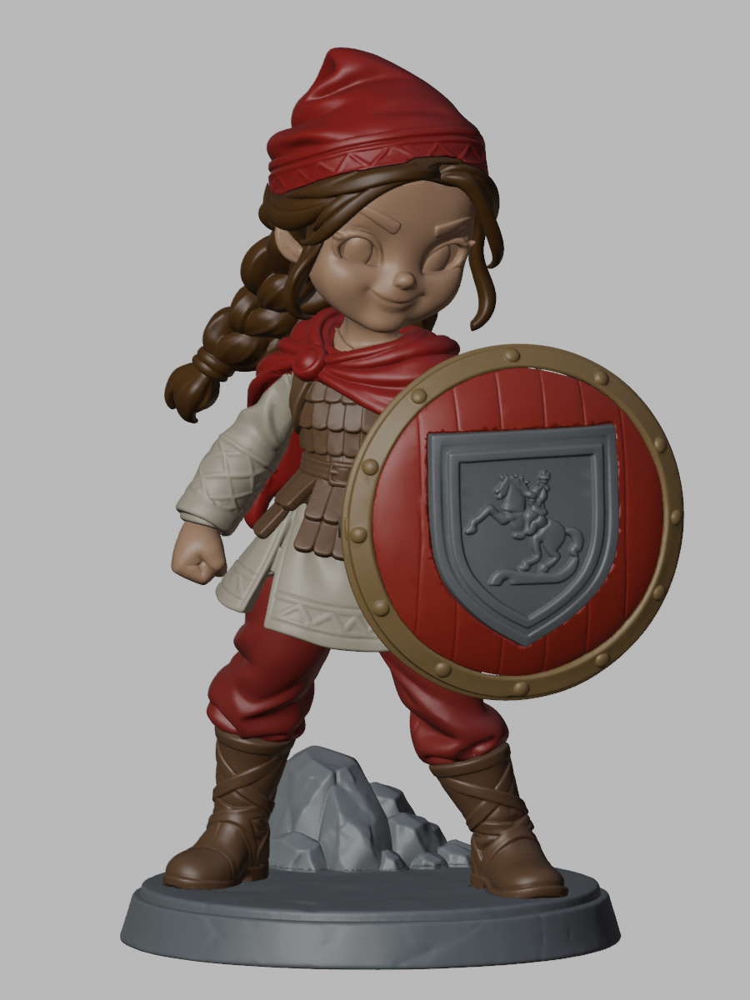

# Amazon Çocuğu Yeniler — v2.1.0 ana sürüm

Kaide dahil **160 mm, 18 parçalı** montaj seti. **Gözler kafayla birleşiktir.** Kafa, gözler, kaşlar ve kirpikler tek kapalı parçadır; ayrı göz STL’si veya göz takma yuvası yoktur.

**[Ana paketi indir](https://github.com/mtarikucar/amazon-cocugu-yeniler/releases/download/v2.1.0/amazon-cocugu-160mm-18-parca-ana-surum-v2.1.0.zip)** · [Sürüm sayfası](https://github.com/mtarikucar/amazon-cocugu-yeniler/releases/tag/v2.1.0) · [Montaj kılavuzu](docs/v2.1.0/MONTAJ.md)

## Paket içeriği

- `STL/`: 18 model parçası; ana kafa `15_Kafa_Gozler_Butun.stl`.
- `Amazon_Cocugu_160mm_Ana_Surum_v2.1.0.blend`: aynı 18 parçalı düzenlenebilir Blender dosyası.
- `Gecme_Testi/`: 2 genel pim–yuva kuponu; figürün parça sayısına dahil değildir.
- Türkçe montaj kılavuzu, parça listesi, kontrol raporları ve SHA256 doğrulama listesi.

Parçalar: kaide, kaya, iki bot, bacaklar, elbise/gövde, ayrı zırh, şal/pelerin, iki kol, iki el, kalkan gövdesi, kalkan çemberi, arma, gözleri bütün kafa, saç ve bere. Eski parça numaraları korunur; 16 ve 17 kullanılmaz.

STL’ler mm ve %100 ölçekte, desteksiz ve ortak montaj konumlarındadır. Baskı yönü ve destekler dilimleyicide hazırlanır. Zırh elbiseden ayrı boyanıp sonradan takılır. Mevcut desen kabartıları korunur. Gözler boya veya decal ile renklendirilir; decal bir baskı dekorudur, ayrı 3B parça değildir.

## Kontroller ve üretim

18 STL yeniden okunup doğrulandı: her biri tek kapalı bileşen, tutarlı yüzey yönleri ve sıfır alanlı üçgen yok; toplam montaj yüksekliği 160 mm. Ana kafa önceki doğrulanmış birleşik gözlü kafa ile dosya düzeyinde aynıdır. Diğer 17 parça değişmemiştir. Kafanın pelerin, saç ve bereyle önceki montaj yolu kontrolleri korunmuştur; bu sürümde tüm montaj yolları yeniden taranmamıştır.

[STL doğrulaması](reports/v2.1.0/STL_Dogrulama.json) · [Kafa kontrolü](reports/v2.1.0/Butun_Gozlu_Kafa.json) · [Parça listesi](reports/v2.1.0/Parca_Listesi.json)

230 adet üretim için hazırlanmakta olan tabla planı da bu birleşik gözlü kafayı ve aynı 18 parça türünü kullanır. Bu ZIP dilimlenmiş yazıcı dosyası değildir. Fiziksel baskı testi yapılmadı; seri üretimden önce kendi reçine ve kürleme ayarlarıyla kupon ve bir tam prototip denenmelidir.

## Göz decal dosyaları

[5 çift A4 PDF](https://github.com/mtarikucar/amazon-cocugu-yeniler/releases/download/v2.0.0/Amazon_Cocugu_Goz_Decal_5_Cift_A4.pdf) · [İris ve gözbebeği PNG](https://github.com/mtarikucar/amazon-cocugu-yeniler/releases/download/v2.0.0/Iris_Gozbebegi_Cifti_Seffaf.png). Bu baskı görselleri birleşik gözlü kafa üzerinde boya/decal uygulaması içindir; fiziksel ölçü önce deneme çıktısıyla kontrol edilmelidir.

## Arşiv

[v2.0.0](https://github.com/mtarikucar/amazon-cocugu-yeniler/releases/tag/v2.0.0) ayrı gözlü eski paketi arşiv olarak korur; asıl sürüm yukarıdaki **v2.1.0, 18 parçalı birleşik gözlü set**tir. [150 mm model arşivi](docs/onceki-150mm-surum.md). Eski ve yeni setleri karıştırmayın.
