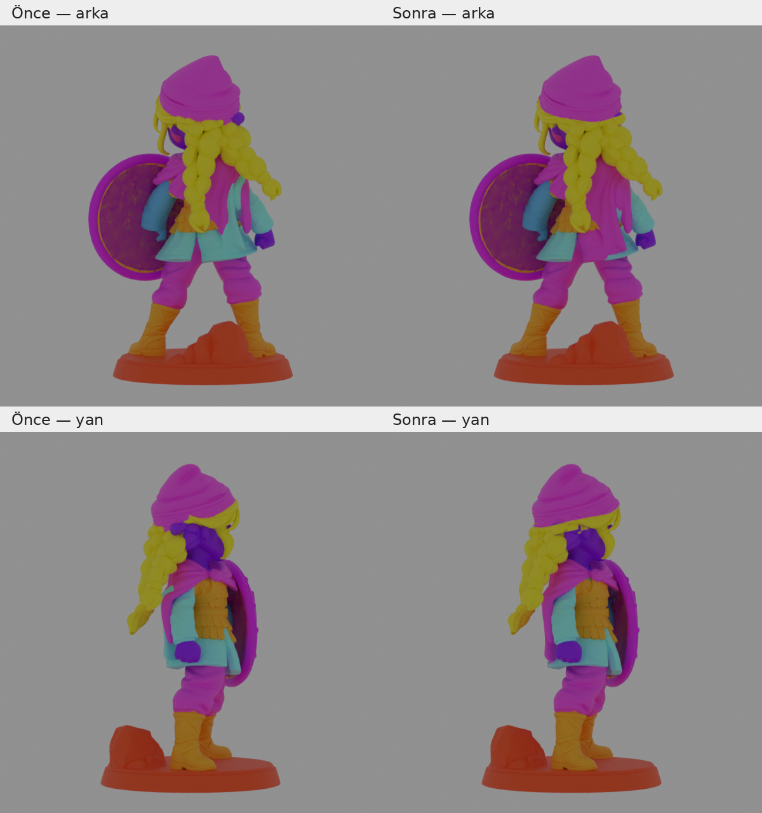

# Amazon Çocuğu Yeniler

150 mm yüksekliğinde, 17 parçalı figür ve Blender inceleme dosyası.



Başlangıç modeli, tercih edilen `01a0d77f-7be7-71a8-8909-d1776eaf0c68` görevinin çıktısıdır. Bere–saç ve pelerin–tunik/kol sınırları bu model üzerinde yeniden düzenlenmiştir. Kalkan, taban, çizme ve pantolon parçaları başlangıç geometrisini korur.

## Dosyalar

- `models/amazon-cocugu-yeniler.blend`: önce/sonra karşılaştırması ve ayrı parçalar için iki sahne.
- `models/parcali-model-150mm.3mf`: ortak montaj altında ayrı nesneler; birim mm.
- `models/ayri-parcalar-150mm-STL.zip`: her parça ayrı STL, ortak montaj koordinatları korunur.
- `models/model.glb`: düzenlenmiş geometri ve parça renkleri, kaynak koordinat ölçeğinde.
- `models/parca-listesi.json`: dosya adları ve parça boyutları.
- `previews/`: önce/sonra görünüşleri.
- `reports/`: geometri ve dışa aktarma kontrolleri.
- `reference/`: yeniden üretim için başlangıç modeli, bölge önerisi ve bere sınırı katsayıları.

## Blender

`01 - Once ve sonra` sahnesinde solda başlangıç modeli, sağda düzeltilmiş model bulunur. `02 - Son 17 parca tek tek` sahnesi parçaları ayrı ayrı gösterir. Sahne menüsü üst çubuktadır.

Seçili parçaya odaklanmak için **Numpad .**, tek başına göstermek için **/**, tümünü görmek için **Home** kullanın.

## Düzenleme yöntemi

Bere–saç kesim yüzeyi orijinal dokudaki yüksek güvenli renk örneklerinden çıkarılan açısal sınırla oluşturulur. Pelerin için kaynak görev `01a0d50e-46b3-72de-9daf-77017bcae990` üzerinden alınan hedefli bölge önerisi kullanılır. Öneri modelinin geometri hacmi doğrudan eklenmez; yalnızca başlangıç modelinin parçalarını yeniden bölmek için kullanılır. Sınır kalıntıları komşu parçalara atanır. Ters yönlü, ihmal edilebilir iç yüzey kalıntısı temizlenir.

Hedefli bölge görevi: `01a0d97a-7a91-72e2-8f91-67096c6a6d0a` (10 kredi).

STL'nin 32 bit koordinat hassasiyetinde çakışan fakat topolojik olarak ayrı kesim noktaları, yüzey silmeden deterministik olarak ayrıştırılır. En büyük nokta hareketi yaklaşık 0,00079 mm'dir. Ayrıntılar `reports/mesh-cleanup.json` dosyasındadır.

Renkler parça ayrımını gösterir; orijinal renk/desen dokuları değildir. Otomatik montaj pimleri eklenmemiştir. Geometrik kontroller fiziksel baskı ve tolerans testi yerine geçmez.

## Yeniden üretme

Python 3.12 ve Blender 5.2.1 ile hazırlanmıştır.

```sh
python -m venv .venv
.venv/bin/pip install -r scripts/requirements.txt
.venv/bin/python scripts/refine_boundaries.py
.venv/bin/python scripts/clean_meshes.py
.venv/bin/python scripts/compare_surfaces.py
.venv/bin/python scripts/export_parts.py
blender -b --python scripts/prepare_blender.py
.venv/bin/python scripts/verify_exports.py
```

Yeniden üretim yerel dosyaları kullanır ve API anahtarı gerektirmez.

## Kontrol kapsamı

Kaynak modellerde çakışan yüzeyler bulunduğundan işaretli Boolean hacim farkı güvenilir bir kayıp ölçüsü değildir; raporda tanılama bilgisi olarak saklanır. Dış yüzey koruması 10 yönden toplam 1.200.000 ışının ilk yüzey kesişimiyle ayrıca ölçülür. Bu örneklemeli kontrol tam matematiksel eşitlik kanıtı değildir. STL dosyaları yeniden içeri aktarılıp kapalı yüzey ve tutarlı yüz yönü açısından kontrol edilir. Fiziksel baskı denenmemiştir.

Son doğrulama: 17 STL kapalı ve yüz yönleri tutarlı; montaj yüksekliği 150 mm. Örneklenen 10 görünüşte kayıp veya eklenen siluet ışını yoktur. Ayrıca başlangıç modelinin 12 parçasının tepe noktaları ve üçgenleri birebir korunmuştur. Kapalı yüzey kontrolü, kendi kendine kesişme veya fiziksel montaj toleransı garantisi değildir.
