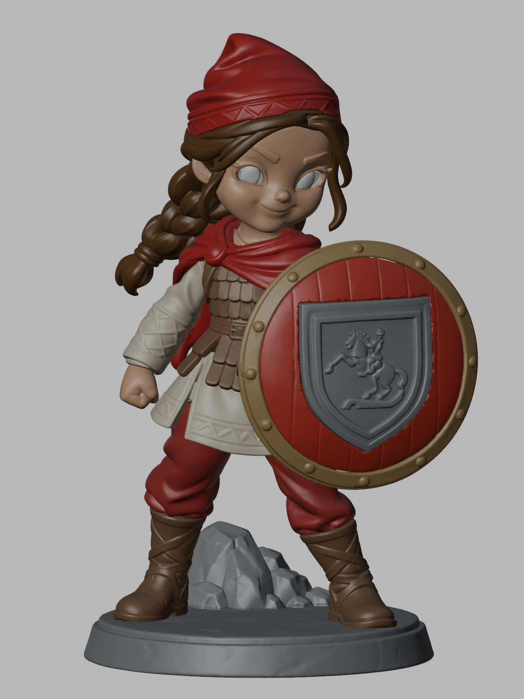
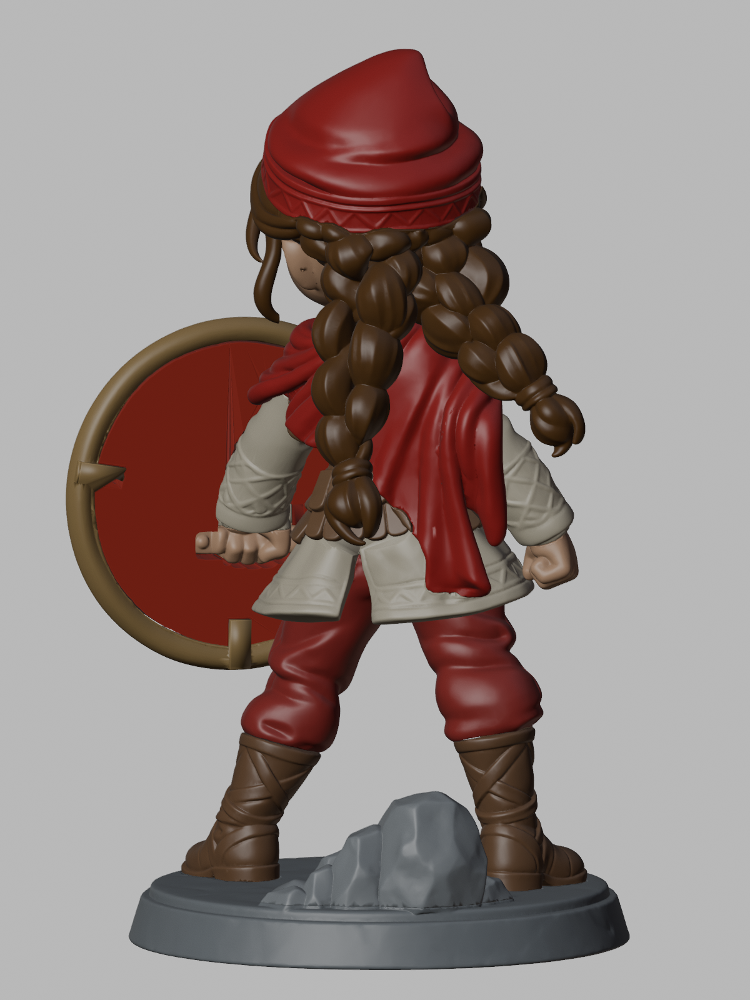
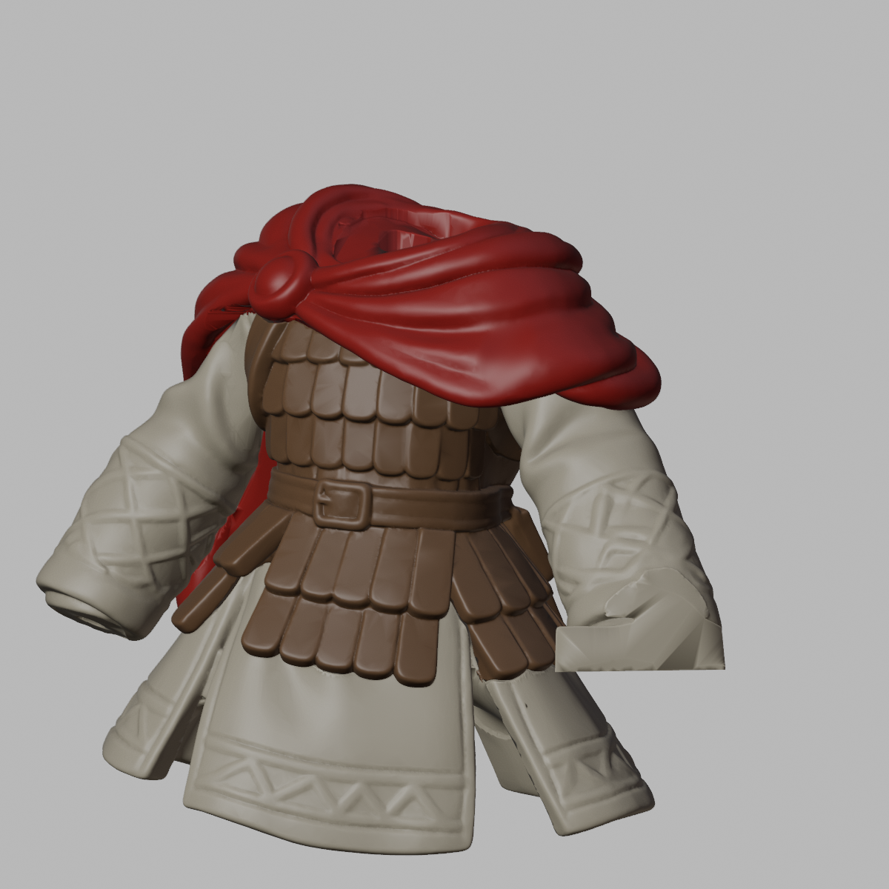

# Amazon Çocuğu — 160 mm / 20 parça

Kaide dahil 160 mm; reçine baskı için pim–yuva geçmeli, yapıştırıcıyla sabitlenebilir montaj seti.

**Sol ve sağ adları, karaktere önden bakan kişinin sol ve sağıdır.** Karakterin anatomik yönüyle karıştırma. `20_Sag_El`, kalkanı tutan ayrı el parçasıdır.

**Alternatif kafa:** ZIP içindeki Alternatif_Kafa/ dosyası, 15_Kafa + 16_Sol_Goz + 17_Sag_Goz yerine geçer. Bu seçenekle 18 parçalı montaj yapılır; diğer adımlar aynıdır.

## Baskıdan önce

1. Hedef toplam yükseklik kaide dahil 160 mm. STL dosyalarının sayısal birimi milimetredir; içe aktarırken %100 ölçekte kullan. STL biçimi birim etiketi taşımaz, bu yüzden dilimleyicide mm seçildiğini doğrula.

2. Parçalar montajdaki ortak konumlarında ve desteksiz verilir. Tek bir parça içe aktarıldığında tabla dışında veya havada görünmesi bu ortak koordinatlardan kaynaklanabilir. Baskı kopyasını dilimleyicide tablaya yerleştir, yönlendir ve destekle.

3. Önce geçme test kuponlarını üretimde kullanacağın reçine, pozlama, yıkama ve kürleme ayarlarıyla bas. Tam yıkama, kurutma ve kürlemeden sonra ölçü ve geçmeyi değerlendir. Kupon etiketleri yan başına boşluğu gösterir; örneğin .20, çapta toplam 0.40 mm fark demektir.

4. Kupondan sonra bir tam prototip bas, tüm parçaları boyasız ve yapıştırıcısız prova et. Uygunluğu gördükten sonra boyalı montaj denemesi yap. 200 adet üretime bu doğrulamadan sonra geç; yazıcı veya reçine değişince kuponu yeniden dene.

5. Pimlere, yuva içine ve oturma yüzeylerine boya/astar birikmesini önle. Zorlanan geçmeyi bastırarak kapatma; önce destek kalıntısı, yön ve baskı toleransını kontrol et. Yapıştırıcı için reçineyle uyumlu ürünü ve üretici kullanım talimatını seç.

## Parça listesi

Her satır bir STL dosyasına ve Blender’daki aynı adlı nesneye karşılık gelir.

| Dosya / nesne | Parça |
| --- | --- |
| `01_Kaide.stl` | Kaide |
| `02_Kaya.stl` | Kaide üstündeki kaya |
| `03_Sol_Bot.stl` | Önden bakışta sol bot |
| `04_Sag_Bot.stl` | Önden bakışta sağ bot |
| `05_Bacaklar.stl` | Bacaklar |
| `06_Elbise.stl` | Elbise / gövde |
| `07_Zirh.stl` | Ayrı zırh |
| `08_Pelerin.stl` | Şal ve pelerin |
| `09_Sol_Kol.stl` | Önden bakışta sol kol |
| `10_Sol_El.stl` | Önden bakışta sol el |
| `11_Sag_Kol.stl` | Kalkan tarafındaki kol |
| `12_Kalkan.stl` | Kalkan gövdesi |
| `13_Kalkan_Cemberi.stl` | Kalkanın dış metal çemberi |
| `14_Arma.stl` | Kalkan arması; atlı kabartma dahil |
| `15_Kafa.stl` | Tek parça kafa; kaşlar ve kirpikler üzerinde |
| `16_Sol_Goz.stl` | Önden bakışta sol göz |
| `17_Sag_Goz.stl` | Önden bakışta sağ göz |
| `18_Sac.stl` | Saç |
| `19_Bere.stl` | Bere |
| `20_Sag_El.stl` | Kalkanı tutan el |

## Montaj sırası

Önce kuru prova yap; yapıştırma ve boya işlemlerini doğruladığın sıraya göre tamamla. “Üstten indir” ifadesi modelin dik durduğu konuma göredir.

1. **Kaide ve kaya.** 01_Kaide üzerine 02_Kaya parçasını üstten indirerek oturt. İlk provada yapıştırıcı kullanma.

2. **Botlar ve bacaklar.** 03_Sol_Bot ve 04_Sag_Bot parçalarını kaideye yerleştir. 05_Bacaklar parçasını iki bota aynı anda hizalayarak üstten indir.

3. **Elbise ve zırh.** Önce 06_Elbise parçasını bacakların üzerine üstten indir. Ardından 07_Zirh parçasını elbisenin üzerine yine üstten oturt. Zırh, elbiseden ayrı boyanıp sonradan takılan parçadır.

4. **Şal ve pelerin.** 08_Pelerin parçasını zırhın üstüne üstten indir; pimleri ve oturma yüzeylerini birlikte hizala.

5. **Sol kol ve eli masada birleştir.** Önce 10_Sol_El parçasını masada, 09_Sol_Kol parçasının bileğindeki eğimli pim doğrultusunda tak. Ardından birleşmiş kol–el grubunu önden bakışta sol taraftan yatay olarak içeri kaydırıp pelerindeki omuz yuvasına oturt. Böylece el montaj sırasında elbisenin kenarına sürtmez.

6. **Kalkan tarafındaki kol ve el.** 11_Sag_Kol parçasını sağ-alt taraftan içeri ve yukarı eğimli biçimde omuz yuvasına oturt. Ardından 20_Sag_El parçasını bilek pimiyle hizalayıp alttan yukarı tak. Kalkan grubunu henüz takma.

7. **Kafa ve gözler.** 15_Kafa parçasını boyun pimiyle pelerine üstten indir. 16_Sol_Goz ve 17_Sag_Goz parçalarını yüzün önünden göz yuvalarına doğru tak. Gözleri ayrı boya; kaşlar ve kirpikler kafa üzerinde kalır.

8. **Saç ve bere.** 18_Sac parçasını kafanın üzerine üstten indir; iki yönlü pim yuvasını hizala. Sonra 19_Bere parçasını saçın tepesindeki pim ve oturma yüzeyi üzerine üstten yerleştir.

9. **Kalkanı masada birleştir.** 13_Kalkan_Cemberi parçasını sabit tut. 12_Kalkan gövdesini arma tarafındaki ön açıklıktan çembere yerleştir. Sonra 14_Arma parçasını kalkanın ön yüzündeki yerine tak. Üç parçayı boyama tamamlandıktan sonra birleştir.

10. **Kalkan grubunu en son tak.** Birleşmiş kalkan grubunu kalkan yüzüne dik doğrultuda önden ele yaklaştırıp oturt. Pimi yuvaya hizala; çemberden bastırarak kolu esnetme. Tüm kuru prova tamamlandıktan sonra uygun reçine yapıştırıcısıyla sırayla sabitle.

## Boya ve desenler

Önizlemedeki renkler parçaları ayırt etmek ve boya planlamak içindir. STL renk taşımaz. Bere, kollar ve kıyafetteki mevcut desen kabartıları korunmuştur; her desen için ayrı STL yoktur. Bu sürümde bu yüzeyler decal için düzleştirilmiş değildir. Waterslide decal uygulanacaksa mevcut kabartının uygunluğunu prototipte değerlendir.

## Blender ve STL kullanımı

Blender dosyasında parçalar yukarıdaki numaralı adlarla ayrı nesnelerdir. Outliner listesinden adını seçerek doğru parçayı bulabilir; diğer nesneleri görünmez yapıp pimleri ve yuvaları inceleyebilirsin. Ana dosyada ortak montaj konumlarını koru. Baskı yerleşimini bir kopyada veya dilimleyicide yap. Tek bir parçayı bağımsız ölçeklemek eşleşen yuvaları bozar; geometri değiştirirsen ilgili STL’yi yeniden dışa aktar ve o geçmeyi yeniden prova et.

## Doğrulama özeti

20 STL dosyasının tamamı yeniden içe aktarılarak doğrulandı: her biri tek kapalı bileşen, tutarlı yüzey yönleri ve sıfır alanlı üçgen yok. Kaide dahil toplam yükseklik 160.000 mm. 190 parça çifti ve montaj sırasında 73 hareketli/sabit parça çifti, toplam 10893 konumda kontrol edildi. Hareketler 0,5 mm aralıkla örneklendi; hesaplanan en büyük ortak hacim 0.00015994 mm³ olup sayısal eşik olan 0,001 mm³ altında. Hareket boşlukları ayrıca sürekli süpürme hacimleriyle açıldı. Bu sonuç belirtilen montaj sırasına ve bu dosyaların geometrisine aittir; gerçek baskı ve minimum duvar kalınlığı doğrulamasının yerini tutmaz.

Sayısal yüzey ve montaj kontrolleri, gerçek reçine baskısının sonuç garantisi değildir. Bu kılavuz tüm yüzeylerde doğrulanmış bir asgari duvar kalınlığı iddiası içermez. Destekler, baskı yönü ve süreç kaynaklı ölçü telafisi yazıcı/reçine profiline göre hazırlanmalıdır.

## Görseller

